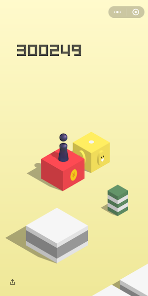
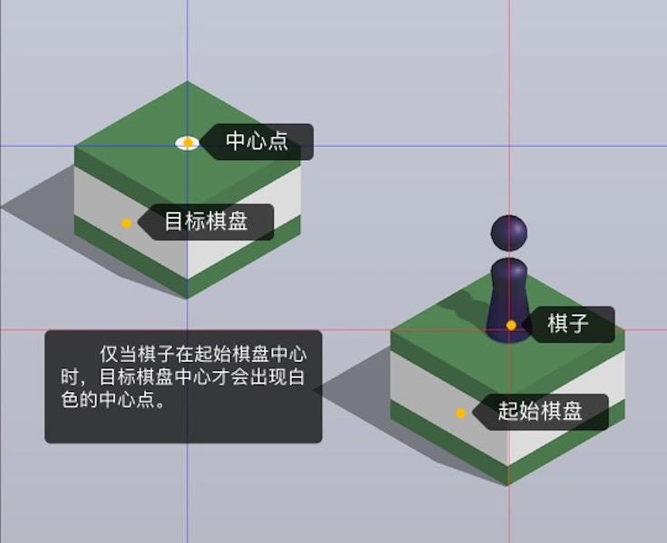
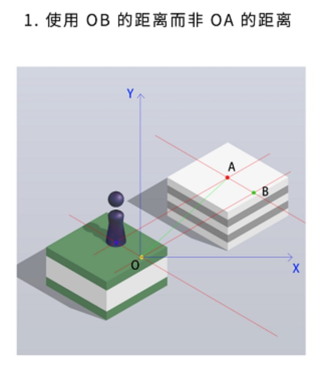

# WechatJump

adb + pillow + opencv + sklearn 实现的微信跳一跳机器人，分数可达 30 万以上。

**反对一切使用外挂的行为，该项目只为学习目的，没有加入反作弊代码，以后也不会有：）**



[TOC]

# 命名约定

为便于描述，做以下约定：



# 特性

与年初的跳一跳机器人相比，进行了以下改进：

- adb 截图后图像直接传输给上位机，不经过手机存储和 SD 卡；上位机一直在内存中处理图像，减少 IO 耗时，提高效率。
- 使用上一次截图的目标棋盘（也是本次截图的起始棋盘）作为模版，使用 OpenCV 模版匹配寻找起始棋盘的中心坐标，根据中心坐标和棋子中心坐标的相对位置、上次计算的跳跃距离计算实际跳跃距离。替代其他项目中在“跳跃后视角平移前”进行截图的方法，不需要反复尝试调整合适的 “Magic Number”，且每次跳跃只需截图一次。简而言之，省力✌️，提高准确性，提高效率；
- 为加快运行速度，只在程序初始化时训练模型，但程序运行时输出的数据可用于回归模型训练。
- 计算两点间距离时，使用两点在跳跃方向（与水平线夹角 30 度）上的投影距离，与欧式距离相比更加精确。即下图中 OB 的距离（图片来源：[腾讯WeTest团队](http://wetest.qq.com/lab/view/364.html)）：



# 使用的技术和库

- OpenCV —— 模版匹配，Canny 边缘检测
- Pillow —— ImageDraw 模块
- sklearn —— 线性回归，多项式回归

# 使用说明

## 环境准备

- 安装 OpenCV 和 adb 工具，MacOS 可以使用 brew 安装，其他系统请参考 [OpenCV 文档](https://docs.opencv.org/3.4.3/da/df6/tutorial_py_table_of_contents_setup.html) 和 [Android 调试桥](https://developer.android.com/studio/command-line/adb?hl=zh-cn)：

```
brew install opencv
brew cask install android-platform-tools
```

- 安装依赖

 ```shell
pip install -r requirements.txt
 ```

## 设置项

在项目根目录 `run.py` 中，有几个配置项需要修改：

- `ADB_DEVICE_SERIAL` 通过 adb devices 命令得到的手机序列号；
- `TRAINING_DATASET` 训练数据文件路径；
- `TRAINING_MODEL` “LR” 线性回归模型，“PR” 一元多项式回归模型；
- `TRAINING_PR_DEGREE` 一元多项式回归模型时，变量的最高指数；
- `JUMP_DELAY` 跳跃后与下次截图之间的时间间隔，单位秒。设置太小会在下次截图时引入中心连跳的涟漪特效，会对边缘检测造成干扰，不放心的话就往大了设置；
- `SHOW_MARKED_IMG` 是否在跳跃时展示标注数据的 RGB 图像。

另外，如果选择展示标注数据的 RGB 图像，还需要向 `assests` 目录中放入 TTF 字体文件（需支持中英文），并命名为 `font.ttf`，用于标注图像。由于版权问题，项目中不包含该字体文件。

## 分辨率

由于模版匹配的特性（踩过的坑第 2 点），不同分辨率手机可能需要重新采集模版图片，模版图片在 `assests` 目录下。

本项目在分辨率为 2160*1080 的小米 6x 上运行正常，理论上相同分辨率的手机都可以直接使用项目自带的模版图片，无需重新采集。

## 运行

将跳一跳小程序打开，并点击开始游戏按钮进入游戏界面。运行：

```
python3 run.py
```

输出数据格式为：

```
[上次跳跃实际距离 pixel] [上次跳跃按压时间 ms] [上次跳跃是否跳中棋盘中心]
```

例如：

```
293.0696181049753 445 True
```

表示上次跳跃按压屏幕 445 ms，实际跳跃距离为 293.0696181049753 像素，且跳中了棋盘中心。

**该数据格式与训练数据格式相同**，因此程序输出数据可保存用作下次启动程序时的模型训练数据。

建议运行时将其保存到文件中：

```
# -u 使 stdout 直接输出，不缓存
python3 -u run.py > run.log
```

# Show Time

## 最好成绩

目前运行到最高的成绩已经超过 30 万（见上图），跑了一晚上没有要停的意思，只能 Ctrl + C 了，理论上分数无上限。

后续再测试每小时大概能跳 23000~24000 分。连跳中心的连击中断造成了一定的分数损失。

## 线性回归拟合


## 多项式回归拟合(degree=7)

.png)

# 踩过的坑

1. 由于图像坐标系从左上角开始，Y轴在向下的方向上是递增的，所以斜率与普通直角坐标系相反。也就是说，从左下到右上方向的直线实际为负斜率。
2. OpenCV 模版匹配对缩放图片处理效果不好，导致从小程序文件解包出来的棋子图像无法使用，必须获取当前分辨率下的棋子图像和中心点图像作为模版；

# 还可以改进的地方

1. 使用并发同时进行上次跳跃评估和本次跳跃计算，提高运行速度；
2. 自动适配不同分辨率的手机屏幕；